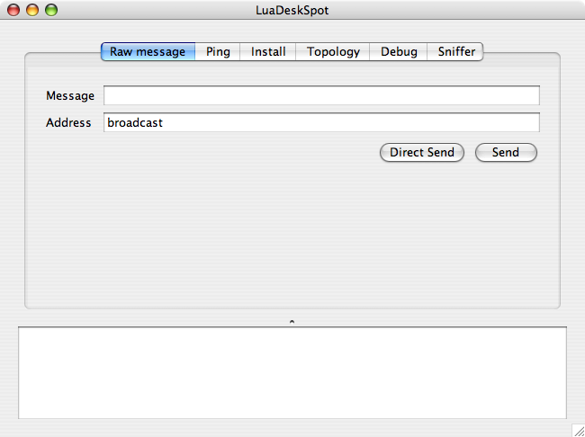

.. _luadeskspot:

LuaDeskSpot
===========

LuaDeskSpot is an example application that contains several modules that
call services in the Lua SPOT. One of the module is the script installation
module that will call installation service in the Lua SPOT. You can use
this installation module to install new Lua scripts to the Lua SPOT.

You will need the Sun SPOT SDK and Java 5 in order to run this application.

Executing LuaDeskSpot
---------------------

To run LuaDeskSpot, go to the project directory and run ``ant host-run`` command. You also need to plug the Sun SPOT base station first before you can run this application.::

   $ cd src/LuaDeskSpot
   $ ant host-run

LuaDeskSpot Modules
-------------------

Raw Message Module
^^^^^^^^^^^^^^^^^^

This module is used to send raw message to the Lua SPOT. The the message in
the Message text box, specify the address in the Address text box, and
click the Send or Direct Send button.

The Send button is used to send the message by calling the routing function
in the Lua SPOTs. If you want to send a raw message without using the
routing function, click the Direct Send button instead.

Ping Module
^^^^^^^^^^^

This module is used to call ``ping`` function of ``demo`` application that
is pre-installed on the Lua SPOT. Any node that receive this message will
send a response ``pong`` to the sender node. You can see the nodes that
respond to the ping message using this module.

.. _install:

Install Module
^^^^^^^^^^^^^^

This module is used to install new script to the Lua SPOTs.

.. image:: install.png

First, select your compiled script file by typing the path or clicking the
``...`` button. Click the ``Load`` button after that to load the file into
memory. You can also see the size and number of fragments that need to be
sent.

After specifiying the destination address and the application name, you can
start sending the install message (including the fragmented application
binary) by clicking the Send Next Fragment button (or the direct send one). Do this multiple times until all fragments are sent.

The receiving Lua SPOT should turn on a LED when it receives and
sucessfully installed the fragmented application. All LEDs will be turned
on with blue color if the last segment is received.

Topology Module
^^^^^^^^^^^^^^^

This module can be used to get the network topology. It also call the ``demo`` application and tell the nodes to exchange messages so all nodes will know their neighbors. This neighbor information is sent back to the host so the host can know the overall topology. The topology graph will be drawn in the application.

Debug Module
^^^^^^^^^^^^

This module shows debug messages that are sent by the Lua SPOT. 

Sniffer Module
^^^^^^^^^^^^^^

This module will show all messages that are received by the application.

